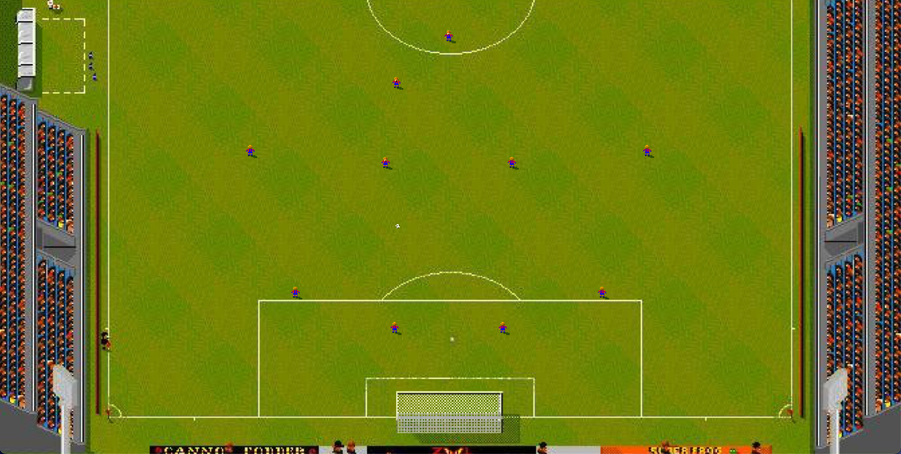

# Sensible Soccer JS



An arcade football prototype inspired by Sensible Soccer, built with Phaser and pixel art assets.

## Current Status

- Real pitch and bottom goal assets integrated into the match scene.
- Two controllable players:
  - `Team 1`: arrow keys + `Space`
  - `Team 2`: `WASD` + `Shift`
- Pass and shot mechanics with different power levels.
- Ball carrying and automatic control switching to the intended receiver for `Team 1`.
- Basic goal detection and ball rebound behavior inside the bottom goal.
- Nine visible outfield teammates for `Team 1`.

## How To Run

No build step is required. Serve the folder with a static server:

```bash
python3 -m http.server 8000
```

Then open:

```text
http://localhost:8000
```

## Project Structure

- [index.html](/Users/joanet/Desktop/sensible%20soccer/index.html)
- [src/scenes/MatchScene.js](/Users/joanet/Desktop/sensible%20soccer/src/scenes/MatchScene.js)
- [src/entities/PlayerController.js](/Users/joanet/Desktop/sensible%20soccer/src/entities/PlayerController.js)
- [assets](/Users/joanet/Desktop/sensible%20soccer/assets)
